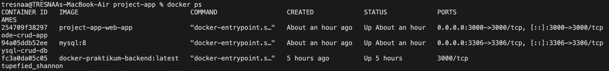
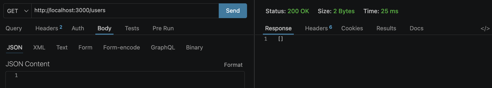
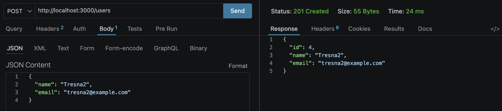
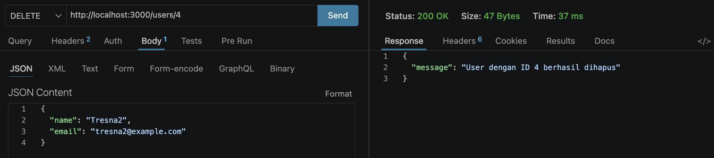

# Final Project Container Deployment - User Service CRUD
Modul Praktikum 06 - Implementasi Multi-Container Application menggunakan Docker dan Docker Compose

## Informasi Mahasiswa
* **Nama:** I Ketut Tresnawan
* **NIM:** 2415354038
* **Repository GitHub:** final-project-docker-2415354038

---

## 1. Pengujian Docker Compose, Volume, Network, dan Container

Aplikasi ini menggunakan arsitektur *multi-container* yang terdiri dari *service* aplikasi backend (Node.js + Express) dan *service* database (MySQL 8) yang diisolasi dalam satu Docker Network internal serta menggunakan Docker Volume untuk *persistence data*.

### Perintah Menjalankan Project:

```docker compose up -d --build```

### Hasil Verifikasi Container & Network:
Setelah menjalankan perintah di atas, status container diverifikasi menggunakan perintah docker ps dengan hasil sebagai berikut:



- Container Backend (node-crud-app): Status Up dan berhasil melakukan port mapping ke 0.0.0.0:3000->3000/tcp.

- Container Database (mysql-crud-db): Status Up dan berjalan pada port internal 3306.

### Hasil Verifikasi Docker Volume (Persistence Data):

1. Menginput data user baru ke dalam database melalui endpoint API.

2. Mematikan dan menghapus seluruh container menggunakan perintah:
docker compose down

3. Menjalankan kembali seluruh layanan menggunakan docker compose up -d.

4. Melakukan GET /users, data user yang diinput sebelumnya tetap aman tersedia dan tidak hilang. Hal ini membuktikan bahwa Docker Volume mysql-persistent-data berfungsi menjaga persistensi data dengan benar.

## 2. Pengujian Endpoint -> Request dan Response

Pengujian fitur CRUD (Create, Read, Update, Delete) pada User Service dilakukan menggunakan API Client (Thunder Client / Postman) dengan hasil request dan response sebagai berikut:

### A. GET /users (Mengambil Semua Data User)

- URL: http://localhost:3000/users

- Method: GET

- Response (Awal/Kosong):



### B. POST /users (Membuat User Baru)

- URL: http://localhost:3000/users

- Method: POST

- Request Body (JSON):

{
  "name": "I Ketut Tresnawan",
  "email": "tresnawan@example.com"
}

- Response (201 Created):

{
  "id": 1,
  "name": "I Ketut Tresnawan",
  "email": "tresnawan@example.com"
}



### C. PUT /users/:id (Mengupdate Data User)

- URL: http://localhost:3000/users/1

- Method: PUT

- Request Body (JSON):

{
  "name": "I Ketut Tresnawan Updated",
  "email": "tresnawan_baru@example.com"
}

- Response (200 OK):

{
  "message": "Data user berhasil diperbarui",
  "id": "1",
  "name": "I Ketut Tresnawan Updated",
  "email": "tresnawan_baru@example.com"
}


### D. DELETE /users/:id (Menghapus User)
- URL: http://localhost:3000/users/1

- Method: DELETE

- Response (200 OK):

{
  "message": "User dengan ID 1 berhasil dihapus"
}



## 3. Pengujian Upload ke Docker Hub

Image aplikasi backend telah berhasil dibuat menggunakan konfigurasi optimal, diberikan tag replika publik, dan diunggah ke registry resmi Docker Hub.

### Perintah Pembuatan Tag dan Push:
docker tag docker-praktikum-backend:latest tresnaaa/docker-praktikum-backend:latest
docker push tresnaaa/docker-praktikum-backend:latest

## 4. Pengujian komparasi ukuran (size) image
pengujian komparasi ukuran (size) image menggunakan perintah docker images.

### Hasil Komparasi Ukuran Image:
- Image Standar Tanpa Optimasi (app-bad): ~1.57 GB

- Image Optimized (app-good / Alpine Linux): ~206 MB

Kesimpulan: Mengganti base image ke arsitektur node:18-alpine serta memanfaatkan susunan Cache Layer terbukti mampu memangkas ukuran penyimpanan image hingga 87% lebih kecil dan mempercepat durasi build secara signifikan.